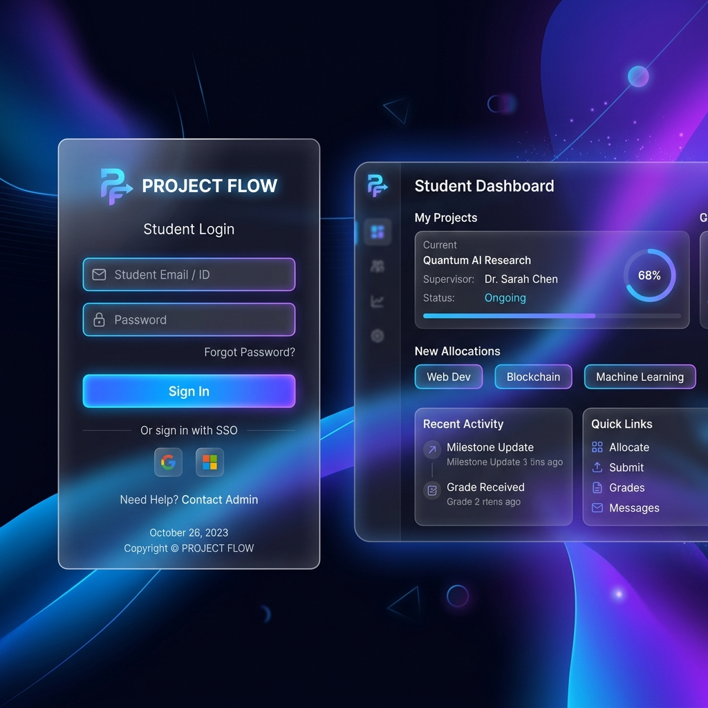
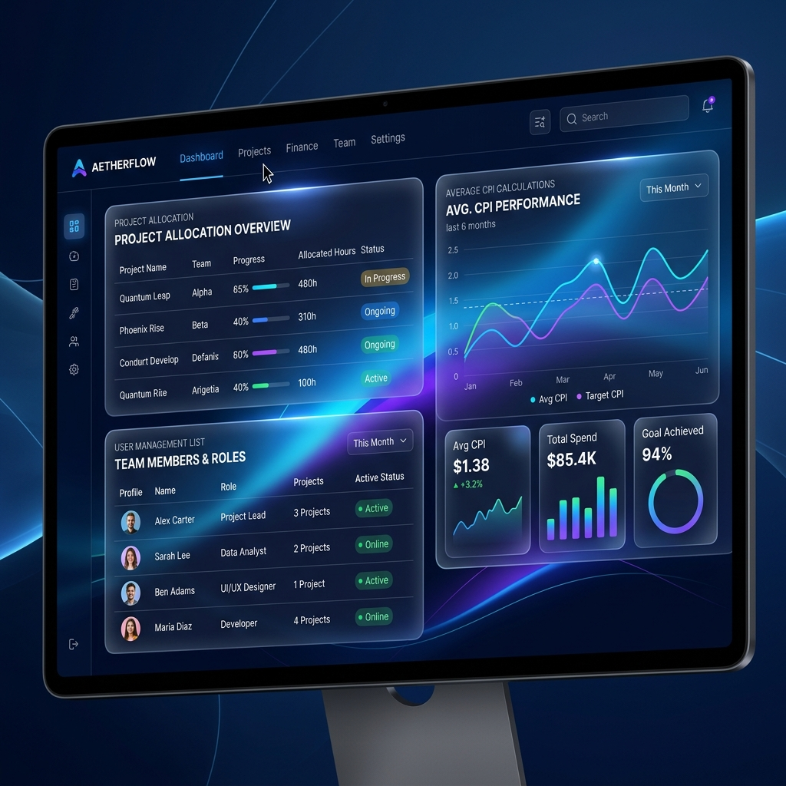

# 🎓 Student Project Allocation System

An interactive and intelligent system designed to streamline the project allocation process for students and academic faculties. Leveraging average Cumulative Performance Index (CPI) rankings, the system automatically matches student group preferences to available project definitions fairly and efficiently.

---

## 🎨 Visual Showcase & Previews

  
  

---

## 🚀 Features

### 👨‍🎓 For Students
- **Interactive Dashboards:** Clear display of ID, Name, CPI, and active round details.
- **Group Management:** Form or update team groups with your peers in real-time.
- **Priority Selection:** Select and prioritize projects. Use drag-and-drop actions to change preference order directly in the interface.
- **Secure Access:** Individual accounts with full captcha validation and password resetting.

### 👩‍🏫 For Admins & Faculty
- **Control Center:** Set rounds and toggle student allocation availability.
- **Algorithm Runner:** Automated, fair project allocation based on the group's average CPI.
- **CRUD Operations:** Dynamically add, update, list, and disable projects, students, and faculty members.
- **Master Reset:** Quickly flush the database to restart a new semester.

---

## ⚙️ Allocation Algorithm Logic
The system prioritizes groups with a higher average academic performance:
1. **Average CPI Calculation:** Calculates the average CPI of all students in each group.
2. **Ranking:** Sorts groups by average CPI descending.
3. **Preferences Allocation:** Loops through each group to allocate their highest-ranked available choice. If a choice is already allocated, it moves down their priority list.

---

## 🛠️ Technology Stack
- **Backend/Scripts:** PHP (Local database connection and session management)
- **Database:** MySQL (Structured tables for students, faculty, projects, groups, and process tracking)
- **Frontend:** Responsive HTML5, Vanilla JavaScript, and Glassmorphic CSS layout variables
- **Testing/Simulation:** Pre-configured `localStorage`-based mock database for static web page previews (GitHub Pages)

---

## 💻 Installation & Usage

### Method 1: Local Deployment (PHP/MySQL)
1. Install a local development suite like **XAMPP**, **WAMP**, or **Laragon**.
2. Clone this repository into the local directory (e.g. `htdocs` or `www`).
3. Open `phpMyAdmin` and import the SQL database file located at `images/database/project_db.sql` or `project_db.sql`.
4. Open your browser and navigate to `http://localhost/Project-Allocation-System/`.

### Method 2: GitHub Pages (Static Interactive Demo)
The project includes a pre-configured static demo running purely in the browser:
1. Enable **GitHub Pages** on your repository.
2. Visit `https://vijaymahes9080.github.io/Project-Allocation-System-php/`.

---

## 👥 Authors & License
- **Author:** Vijay Mahes ([Vijaypradhap2004@gmail.com](mailto:Vijaypradhap2004@gmail.com))
- **License:** MIT License (See the [LICENSE](LICENSE) file for more info)
